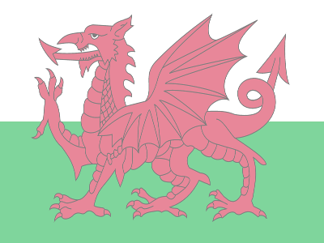
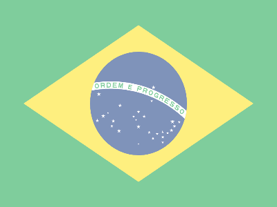
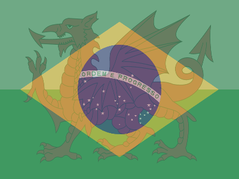
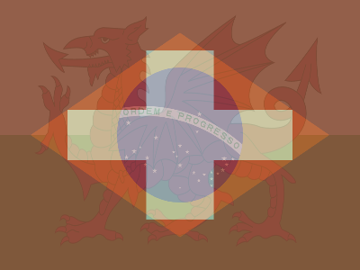

# Image composition using NVIDIA NPP with CUDA

## Overview

This project contains a code that composes RGBA images using CUDA.
First, it convert all images to RGBA for an uniform alpha and resizes them to the same
size. Them, all the images are combined into a single figure.

It is based on [FreeImage](https://freeimage.sourceforge.io/) and NPP (NVIDIA 2D Image And Signal Performance Primitives).

## Repo architecture

- `bin`: folder for storing the build, empty.
- `data`: sample data. Sub-folder `flads` contains country flags from Hampus Joakim Borgos repo    [country-flags](https://github.com/hampusborgos/country-flags.git).
- `external`: folder for storing the external code (FreeImage, cuda-samples), empty.
- `results`: folder for storing the results, contains a sample and the combination of all flags.
- `src`: source code. 

## How to

### Build

Run `make build` to compile the code.

Dependencies: FreeImage, CUDA, NPP
Tested with CUDA 11.3 with C++11.

Header files can be obtained by running `make getCode` or `make get` (also getting the data if not found), or downloaded directly (last november/2025):

- CUDA samples: https://github.com/NVIDIA/cuda-samples
- FreeImage: http://downloads.sourceforge.net/freeimage/FreeImage3180.zip

### Run

Value in parenthesis is the default value.
Arguments:

- `--width`: target image size (1000px).
- `--height`: target image width (666px).
- `--alpha`: opacity level from 0 to 1 ()).
- `--steps`: flag to indicate that the preliminary images must be exported.
- `--input`: input folder/
- `--output`: output folder. results/sub-set-flags/ \
         
## Example

The flags of Wales, Brazil and Switzerland (in this order), stored in `data/sub-set-flags` are combined with:

```bash
bin/main --width=400 --height=300  --alpha 0.5 \
         --steps --input data/sub-set-flags/ --output results/sub-set-flags/ \
         > results/sub-set-flags/output.log
```

The steps of the procedure are illustrated next:

<table>
  <tr>
    <td></td>
    <td></td>
    <td></td>
   </tr> 
   <tr>
      <!-- <td></td>
      <td> -->
      <td></td>
      <td></td>
      <td></td>
  </td>
   <tr>
      <!-- <td></td>
      <td> -->
      <td></td>
      <td></td>
  </td>
  </tr>
</table>


The used interpolation and blending operation are hard-coded in `main.cpp` as
`NPPI_INTER_CUBIC` and `NPPI_OP_ALPHA_OVER`.
